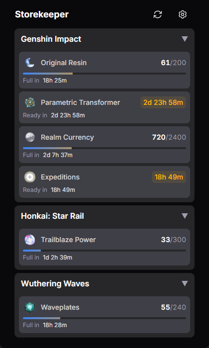

# Storekeeper

Stamina resource tracking desktop tray application for various gacha games.

## Features

- **Real-time Stamina Tracking**: Monitor your stamina/energy resources across multiple gacha games
- **System Tray Application**: Runs quietly in the background with a convenient system tray interface
- **Desktop Notifications**: Get notified when your stamina reaches configurable thresholds or is full
- **Auto Daily Rewards**: Automatically claim daily check-in rewards for HoYoLab games (optional)
- **Multi-Game Support**:
  - Genshin Impact (Original Resin, Realm Currency, Parametric Transformer, Expeditions)
  - Honkai: Star Rail (Trailblaze Power)
  - Zenless Zone Zero (Battery)
  - Wuthering Waves (Waveplates)

## Installation

### Pre-built Releases

Download the latest release for your platform from the [Releases](https://github.com/kvnxiao/storekeeper/releases) page.

### Building from Source

See [DEVELOPMENT.md](DEVELOPMENT.md) for build instructions.

## Configuration

Storekeeper auto-creates `config.toml` and `secrets.toml` with commented templates on first launch. You can also configure everything through the in-app settings UI.

Config files are stored in your system's config directory (also accessible via the "Open config folder" button in settings):

| Platform | Config Directory                             |
| -------- | -------------------------------------------- |
| Windows  | `%APPDATA%\storekeeper\`                     |
| macOS    | `~/Library/Application Support/storekeeper/` |
| Linux    | `~/.config/storekeeper/`                     |

### HoYoLab Games (Genshin, HSR, ZZZ)

To add HoYoLab credentials in `secrets.toml`:

1. Go to [HoYoLab](https://www.hoyolab.com) and log in
2. Open browser Developer Tools (F12) > Application > Cookies
3. Copy the values for `ltmid_v2`, `ltoken_v2`, and `ltuid_v2`

### Wuthering Waves

Credentials are automatically loaded from the Kuro launcher cache at:
`%APPDATA%\KR_G153\A1730\KRSDKUserLauncherCache.json`

No manual configuration required if you've logged into the game launcher.

## Development

See [DEVELOPMENT.md](DEVELOPMENT.md) for architecture details, development setup, and contribution guidelines.

## License

MIT License - see [LICENSE](LICENSE) for details.
