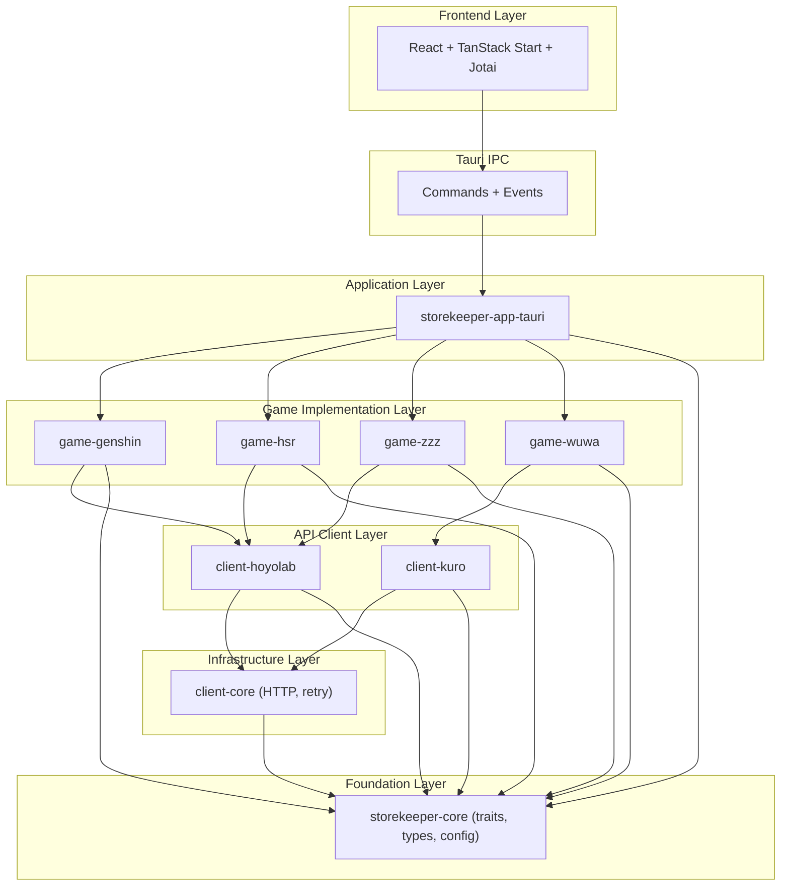
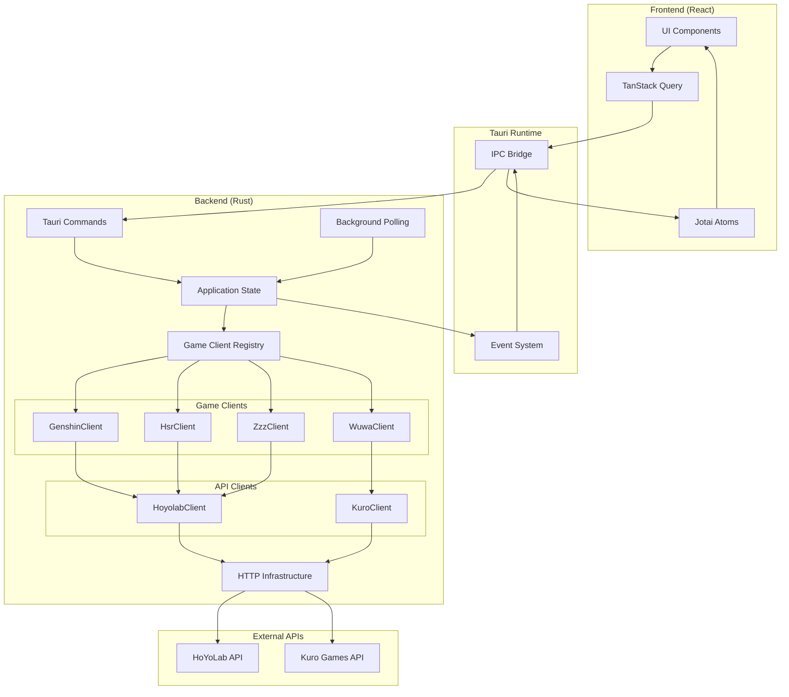

# Architecture Overview

## Introduction

Storekeeper is a desktop application built with [Tauri](https://tauri.app/) that tracks stamina resources for gacha games (Genshin Impact, Honkai: Star Rail, Zenless Zone Zero, Wuthering Waves). The architecture follows a layered design with clear separation of concerns between the Rust backend and React frontend.

## Architecture Style

**Layered Architecture with Plugin-Based Extensibility**

The system is organized into distinct layers with unidirectional dependencies flowing from top to bottom:

## High-Level System Diagram

## Core Architectural Principles

### 1. Separation of Concerns

Each crate has a single, well-defined responsibility:

- **storekeeper-core**: Defines contracts (traits) and shared types
- **storekeeper-client-core**: Provides HTTP infrastructure with retry
- **storekeeper-client-\***: Implements API provider-specific authentication and requests
- **storekeeper-game-\***: Implements game-specific business logic
- **storekeeper-app-tauri**: Orchestrates all components and manages application lifecycle

### 2. Dependency Inversion

High-level modules depend on abstractions (traits), not concrete implementations. The `GameClient` and `DailyRewardClient` traits in `storekeeper-core` define the contract that all game implementations fulfil. The application layer works with type-erased trait objects (`Box<dyn DynGameClient>`) so it never depends on concrete game types.

### 3. Type Safety

Strong typing prevents errors at compile time:

- **`GameId` enum** replaces string-based game identification
- **`Region` enum** ensures valid region values
- **`StaminaResource`, `CooldownResource`** provide structured data with validation
- **Tagged enums** (e.g., `GenshinResource`) serialize as discriminated unions for frontend type safety

### 4. Rate Limit Management

Games are grouped by API provider. Within each provider, requests are made **sequentially** to avoid rate limits. Different providers are queried **in parallel** for efficiency. See [04-data-flow.md](04-data-flow.md) for details.

### 5. Event-Driven Frontend Updates

Backend emits events to the frontend for real-time updates without polling. The frontend subscribes via Jotai effect atoms that update the TanStack Query cache on each event.

## Key Design Decisions

### Why Cargo Workspace?

Multi-crate workspace instead of a monolithic application. Each game and API client is an independent crate, enabling parallel compilation, isolated testing, and the ability to add new games without modifying existing code. The trade-off is more complex build configuration, but it's worthwhile for this use case.

### Why Type Erasure (DynGameClient)?

`GameClient` uses associated types (`type Resource`, `type Error`), which means different game clients have incompatible types. `DynGameClient` erases these types by serializing resources to `serde_json::Value`, enabling storage in a single `HashMap<GameId, Box<dyn DynGameClient>>`. A blanket implementation automatically converts any `GameClient` into a `DynGameClient`. See [03-core-components.md](03-core-components.md) for details.

### Why Tauri Over Electron?

- **Binary size**: Tauri apps are ~3-5MB vs Electron's ~150MB
- **Memory usage**: No bundled Chromium; uses OS webview
- **Native performance**: Rust backend for I/O and computation
- **Security**: Rust's memory safety + restricted IPC surface

### Why Jotai Over Redux?

- **Atomic state**: Granular reactivity; components subscribe to specific atoms
- **Derived state**: Computed atoms automatically update
- **Minimal boilerplate**: No reducers, actions, or dispatchers
- **Integration**: `atomWithQuery` bridges Jotai and TanStack Query

## Technology Stack

| Layer | Technology | Why |
|-------|-----------|-----|
| Backend Runtime | Rust | Memory safety, performance, async/await |
| Desktop Framework | Tauri 2 | Small binaries, native performance |
| HTTP Client | reqwest + reqwest-middleware | Async, retry middleware |
| Async Runtime | Tokio (via Tauri) | Multi-threaded, mature |
| Frontend Framework | React 19 | Stable, large ecosystem |
| Router | TanStack Router | Type-safe, file-based routing |
| State Management | Jotai | Atomic updates, derived state |
| Server State | TanStack Query | Caching, background updates |
| UI Components | React Aria Components | Accessible, unstyled primitives |
| Styling | Tailwind CSS 4 | Utility-first, dark mode |
| Animations | Motion | Performant, declarative |

## Further Reading

- [02-directory-structure.md](02-directory-structure.md) — Crate layout and dependency graph
- [03-core-components.md](03-core-components.md) — Traits, registries, state management
- [04-data-flow.md](04-data-flow.md) — Complete data flow from API to UI
