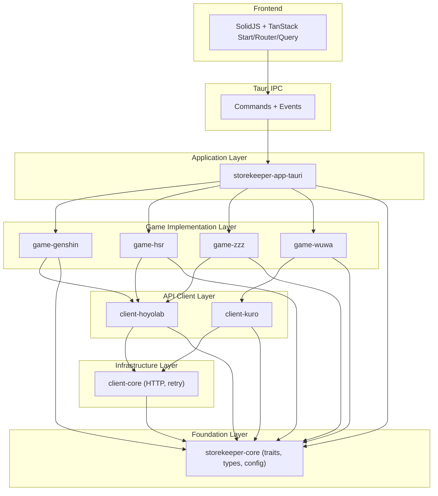

# Architecture Overview

Storekeeper is a desktop application built with [Tauri](https://tauri.app/) that tracks stamina resources for gacha games (Genshin Impact, Honkai: Star Rail, Zenless Zone Zero, Wuthering Waves). A Rust workspace owns all I/O, scheduling, and state; a SolidJS frontend renders it.

## Architecture Style

Layered, with a plugin seam at the game level. Dependencies flow in one direction: frontend to application layer, application to games, games to API clients, everything to the foundation crate.

```mermaid
graph TB
    subgraph Presentation["Frontend"]
        FE["SolidJS + TanStack Start/Router/Query"]
    end

    subgraph IPC["Tauri IPC"]
        Bridge["Commands + Events"]
    end

    subgraph Application["Application Layer"]
        App["storekeeper-app-tauri"]
    end

    subgraph Game["Game Implementation Layer"]
        GG["game-genshin"]
        GH["game-hsr"]
        GZ["game-zzz"]
        GW["game-wuwa"]
    end

    subgraph Client["API Client Layer"]
        CH["client-hoyolab"]
        CK["client-kuro"]
    end

    subgraph Infra["Infrastructure Layer"]
        CC["client-core (HTTP, retry)"]
    end

    subgraph Foundation["Foundation Layer"]
        Core["storekeeper-core (traits, types, config)"]
    end

    FE --> Bridge
    Bridge --> App
    App --> GG & GH & GZ & GW
    GG & GH & GZ --> CH
    GW --> CK
    CH & CK --> CC
    CC --> Core
    GG & GH & GZ & GW --> Core
    CH & CK --> Core
    App --> Core
```

## Core Principles

**Separation of concerns.** Each crate has one responsibility: the foundation crate defines contracts and shared types, the client crates handle transport and provider authentication, the game crates hold game-specific logic, and the Tauri crate orchestrates lifecycle and state. The frontend applies the same split: business state and logic live in state modules, and components are views over them.

**Dependency inversion.** The application layer talks to games through traits and stores them type-erased, so adding a game requires no changes to polling, registries, or state.

**Type safety at the edges.** Games, regions, and resource kinds are enums rather than strings, and game resources serialize as discriminated unions so the frontend can exhaustively match them.

**Provider-aware rate limiting.** Requests are grouped by API provider: sequential within a provider, parallel across providers. This is the constraint that shapes fetching, and it applies to both resource polling and daily reward claiming.

**Event-driven frontend updates.** The backend pushes updates over Tauri events; the frontend never polls the backend. Event listeners are registered once for the app's lifetime and write into the query cache.

**One locale catalog, two i18n runtimes.** Locale strings live in a single catalog shared by the Rust backend (tray labels, OS notifications) and the frontend (all UI text).

## Key Design Decisions

### Why a Cargo workspace?

Each game and API client is an independent crate. This gives isolated testing, parallel compilation, and a genuine plugin boundary: a new game is a new crate plus registration. The cost is a more involved build configuration.

### Why type erasure for game clients?

Game client implementations have different associated resource and error types, so they cannot share a collection. Erasing them to JSON at the trait boundary makes a single registry possible, at the cost of vtable dispatch and one serialization step. The application layer then handles resources as opaque data, which is also what it forwards to the frontend.

### Why Tauri over Electron?

Small binaries (single-digit MB rather than ~150MB), no bundled browser engine, a Rust backend for I/O and scheduling, and a narrow IPC surface.

### Why SolidJS state modules instead of a state library?

Solid's primitives work at module scope, so shared client state needs no third-party store. Business state sits in state modules that export accessors and named actions, which keeps it testable without rendering. Server state stays in the query cache instead of being copied into stores, so there is exactly one source of truth per kind of state.

### Why one catalog for two i18n implementations?

The two runtimes cannot share an implementation: the backend needs ICU plural and duration formatting in Rust, and the frontend needs compile-time, tree-shakeable message functions. They can share the data. One file per locale means one place to translate and no drift between a game or resource name as it appears in the tray, in a notification, and in the UI.

### Why OS notifications rather than in-app alerts?

The app's primary mode is minimized to tray, where in-app alerts are invisible. The notification checker also reads only cached state, so alerting never triggers API calls.

## Technology Stack

| Layer | Technology |
|-------|-----------|
| Backend runtime | Rust (2024 edition) |
| Desktop framework | Tauri 2 |
| HTTP | reqwest with retry middleware |
| Async runtime | Tokio (via Tauri) |
| Date and time | jiff |
| OS notifications | tauri-plugin-notification |
| Backend i18n | ICU4X |
| Frontend framework | SolidJS |
| Router and app framework | TanStack Solid Router and Start (SPA mode with prerender) |
| Server state | TanStack Solid Query |
| Forms | TanStack Solid Form |
| UI primitives | Kobalte |
| Styling | Tailwind CSS with tailwind-variants |
| Frontend i18n | Paraglide JS (inlang) |
| Frontend toolchain | Vite+ (`vp`) |

## Further Reading

- [02-directory-structure.md](02-directory-structure.md) for crate layout and the dependency graph
- [03-core-components.md](03-core-components.md) for the concepts behind registries, state, notifications, and i18n
- [04-data-flow.md](04-data-flow.md) for how data moves from the game APIs to the UI
