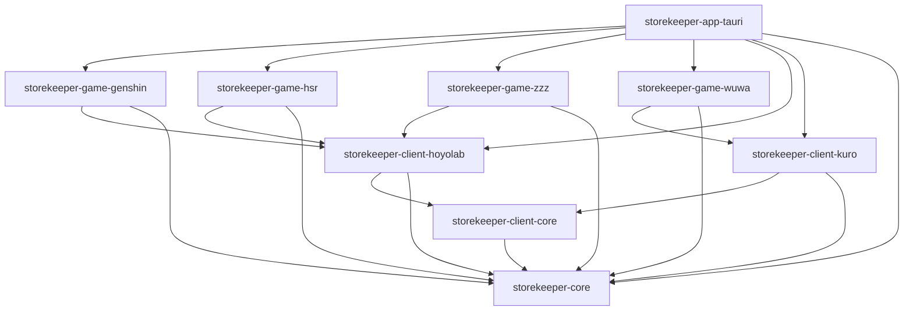

# Directory Structure

## Root Layout

```
storekeeper/
├── storekeeper-core/              # Foundation: traits, types, config
├── storekeeper-client-core/       # HTTP infrastructure with retry
├── storekeeper-client-hoyolab/    # HoYoLab API client (Genshin, HSR, ZZZ)
├── storekeeper-client-kuro/       # Kuro Games API client (Wuthering Waves)
├── storekeeper-game-genshin/      # Genshin Impact GameClient implementation
├── storekeeper-game-hsr/          # Honkai: Star Rail GameClient implementation
├── storekeeper-game-zzz/          # Zenless Zone Zero GameClient implementation
├── storekeeper-game-wuwa/         # Wuthering Waves GameClient implementation
├── storekeeper-app-tauri/         # Tauri application orchestrator
├── frontend/                      # React frontend
├── docs/                          # Documentation
│   ├── architecture/              # Architecture docs
│   ├── onboarding/                # Getting started guides
│   └── standards/                 # Coding standards
├── Cargo.toml                     # Workspace manifest
├── justfile                       # Command runner recipes
├── DEVELOPMENT.md                 # Development guide
└── README.md                      # Project overview
```

**Convention**: Crates are placed at the root level (not in a `crates/` subdirectory) for simpler navigation.

## Crate Dependency Graph



**Dependency rules**:
- Application layer → Game layer → Client layer → Infrastructure → Core
- No circular dependencies
- Core has zero dependencies on other workspace crates

## Foundation Layer: `storekeeper-core/`

Defines contracts and shared types used across all crates.

```
storekeeper-core/src/
├── lib.rs              # Public exports
├── game.rs             # GameClient trait, DynGameClient (type erasure)
├── daily_reward.rs     # DailyRewardClient trait, DynDailyRewardClient
├── resource.rs         # StaminaResource, CooldownResource, ExpeditionResource
├── game_id.rs          # GameId enum, ApiProvider enum
├── region.rs           # Region enum for game servers
├── config.rs           # AppConfig, SecretsConfig, TOML parsing
├── error.rs            # Core error types
├── macros.rs           # Utility macros
└── serde_utils.rs      # Custom serde deserializers
```

## Infrastructure Layer: `storekeeper-client-core/`

HTTP client infrastructure with retry logic and middleware.

```
storekeeper-client-core/src/
├── lib.rs              # Public exports
├── client.rs           # HttpClientBuilder with builder pattern
├── response.rs         # ApiResponse trait, HoyolabApiResponse
├── retry.rs            # RetryConfig, exponential backoff
└── error.rs            # ClientError types
```

## API Client Layer

### `storekeeper-client-hoyolab/`

HoYoLab API client for miHoYo/HoYoverse games. Handles cookie-based authentication and dynamic secret (DS) generation for request signing.

```
storekeeper-client-hoyolab/src/
├── lib.rs              # Public exports
├── client.rs           # HoyolabClient (GET/POST with auth)
├── ds.rs               # Dynamic secret generation (MD5-based)
└── error.rs            # HoYoLab-specific errors
```

### `storekeeper-client-kuro/`

Kuro Games API client for Wuthering Waves. Auto-loads credentials from the launcher cache file.

```
storekeeper-client-kuro/src/
├── lib.rs              # Public exports
├── client.rs           # KuroClient
├── cache.rs            # Load credentials from KRSDKUserLauncherCache.json
└── error.rs            # Kuro-specific errors
```

## Game Implementation Layer

Each game crate follows the same structure:

```
storekeeper-game-{name}/src/
├── lib.rs              # Public exports
├── client.rs           # {Game}Client implementing GameClient trait
├── resource.rs         # Game-specific resource enum (tagged union)
└── error.rs            # Game-specific error types
```

Resource enums use `#[serde(tag = "type", content = "data")]` to produce discriminated unions in JSON, enabling type-safe consumption in the frontend.

## Application Layer: `storekeeper-app-tauri/`

Orchestrates all components and manages the application lifecycle.

```
storekeeper-app-tauri/src/
├── lib.rs                      # Entry point, Tauri setup, shutdown handling
├── main.rs                     # Binary entry point
├── commands.rs                 # Tauri command handlers (IPC surface)
├── state.rs                    # AppState with Arc<RwLock<StateData>>
├── registry.rs                 # GameClientRegistry (dynamic client collection)
├── daily_reward_registry.rs    # DailyRewardRegistry
├── clients.rs                  # Client factory functions (config → clients)
├── polling.rs                  # Background polling loop with cancellation
├── scheduled_claim.rs          # Scheduled daily reward claiming with retry
├── tray.rs                     # System tray menu (Refresh, Config, Quit)
└── events.rs                   # Event type definitions for frontend IPC
```

## Frontend: `frontend/`

Feature-based module organization with React 19, TanStack Start, and Jotai.

```
frontend/src/
├── modules/                    # Feature modules
│   ├── atoms.ts               # Global atom container (AtomsContainer class)
│   ├── core/                  # Cross-cutting concerns
│   │   ├── core.atoms.ts     # Tick system, resources query, event listeners
│   │   ├── core.config.ts    # Config query atom
│   │   └── core.queryClient.ts # TanStack Query client setup
│   ├── games/                 # Per-game UI
│   │   ├── games.constants.ts
│   │   ├── games.types.ts
│   │   ├── genshin/           # Genshin components + atoms
│   │   ├── hsr/               # HSR components + atoms
│   │   ├── zzz/               # ZZZ components + atoms
│   │   └── wuwa/              # Wuwa components + atoms
│   ├── resources/             # Shared resource display
│   │   ├── components/        # StaminaCard, CooldownCard, etc.
│   │   ├── resources.hooks.ts
│   │   ├── resources.query.ts # Tauri command wrappers
│   │   ├── resources.types.ts # TypeScript interfaces
│   │   └── resources.utils.ts
│   ├── settings/              # Settings page
│   │   ├── components/
│   │   ├── settings.atoms.ts
│   │   ├── settings.query.ts
│   │   └── settings.types.ts
│   └── ui/                    # Shared UI components
│       ├── components/        # Button, Card, GameSection, etc.
│       ├── ui.animations.ts
│       └── ui.styles.ts       # tailwind-variants utilities
├── routes/                    # TanStack Router file-based routes
│   ├── __root.tsx            # Root layout (providers)
│   ├── index.tsx             # Dashboard page
│   └── settings.tsx          # Settings page
├── router.tsx                 # Router configuration
└── routeTree.gen.ts          # Auto-generated route tree
```

### Module Structure Convention

Each feature module follows this pattern:

```
{feature}/
├── components/               # UI components
├── {feature}.atoms.ts       # Jotai atoms
├── {feature}.query.ts       # TanStack Query options
├── {feature}.types.ts       # TypeScript types
├── {feature}.hooks.ts       # Custom React hooks (optional)
└── {feature}.utils.ts       # Utility functions (optional)
```

See [frontend-components.md](../standards/frontend/frontend-components.md) for naming conventions.

## Adding a New Game

1. **Create game crate**: `storekeeper-game-{name}/`
2. **Add to workspace**: Update root `Cargo.toml` members and workspace dependencies
3. **Register in app**: Update `storekeeper-app-tauri/src/clients.rs` factory functions
4. **Add frontend**: Create `frontend/src/modules/games/{name}/` with section component and atoms
5. **Update dashboard**: Add section to `frontend/src/routes/index.tsx`

No changes required to registry logic, polling system, or state management — they work with `DynGameClient` trait objects.

See [DEVELOPMENT.md](../../DEVELOPMENT.md#adding-a-new-game) for full details.
