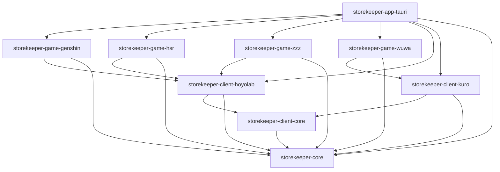

# Directory Structure

## Root Layout

```
storekeeper/
├── storekeeper-core/              # Foundation: traits, shared types, config
├── storekeeper-client-core/       # HTTP infrastructure with retry
├── storekeeper-client-hoyolab/    # HoYoLab API client (Genshin, HSR, ZZZ)
├── storekeeper-client-kuro/       # Kuro Games API client (Wuthering Waves)
├── storekeeper-game-genshin/      # Per-game GameClient implementations
├── storekeeper-game-hsr/
├── storekeeper-game-zzz/
├── storekeeper-game-wuwa/
├── storekeeper-app-tauri/         # Tauri application orchestrator
├── frontend/                      # SolidJS frontend
├── locales/                       # Shared i18n catalog (backend + frontend)
├── docs/                          # Architecture and onboarding docs
├── .agents/skills/                # Agent coding standards
├── .claude/skills/                # Claude Code coding standards
├── Cargo.toml                     # Workspace manifest
└── justfile                       # Command runner recipes
```

Crates live at the root rather than under a `crates/` directory, for simpler navigation.

## Crate Dependency Graph


```mermaid
graph TD
    AppTauri[storekeeper-app-tauri]

    GameGenshin[storekeeper-game-genshin]
    GameHSR[storekeeper-game-hsr]
    GameZZZ[storekeeper-game-zzz]
    GameWuwa[storekeeper-game-wuwa]

    ClientHoyolab[storekeeper-client-hoyolab]
    ClientKuro[storekeeper-client-kuro]
    ClientCore[storekeeper-client-core]

    Core[storekeeper-core]

    AppTauri --> GameGenshin & GameHSR & GameZZZ & GameWuwa
    AppTauri --> ClientHoyolab & ClientKuro
    AppTauri --> Core

    GameGenshin & GameHSR & GameZZZ --> ClientHoyolab
    GameWuwa --> ClientKuro

    GameGenshin & GameHSR & GameZZZ & GameWuwa --> Core

    ClientHoyolab & ClientKuro --> ClientCore
    ClientHoyolab & ClientKuro --> Core

    ClientCore --> Core
```

**Dependency rules**: application to game to client to infrastructure to core. No cycles, and the core crate depends on no other workspace crate.

## What Each Layer Owns

| Crate | Owns |
|---|---|
| `storekeeper-core` | Game and daily reward traits, resource and identifier types, config and secrets types with their TOML handling |
| `storekeeper-client-core` | HTTP client construction, retry and backoff policy, shared API response handling |
| `storekeeper-client-hoyolab`, `storekeeper-client-kuro` | Provider authentication and request signing, provider-specific errors |
| `storekeeper-game-*` | One game's API responses, its mapping into shared resource types, its resource enum |
| `storekeeper-app-tauri` | Registries, application state, background tasks (polling, scheduled claims, notifications), IPC commands and events, tray, backend i18n |

Game crates share an identical shape (client, resource enum, errors), which is what makes adding a game mechanical.

## Shared Locales

`locales/` holds one catalog per supported locale. The Rust backend embeds them at compile time for tray labels and OS notifications; Paraglide compiles the same files into frontend message functions. Keys are flat snake_case in a single namespace, with a prefix naming the area (notifications, tray, dashboard, settings, and shared game and resource names). Values use ICU MessageFormat syntax.

Frontend message output is generated and gitignored. Never edit it by hand.

## Frontend Module Structure

`frontend/src/` holds `routes/` for file-based routes and `modules/` for feature modules. Each feature module owns its components and its non-view logic:

```
{feature}/
├── components/               # UI components (PascalCase .tsx, no suffix)
└── {feature}.{type}.ts       # One file per role, see the suffix table
```

TypeScript files use `<module>.<type>.ts` naming: the `<module>` prefix matches the parent directory and `<type>` indicates the file's single role.

| Suffix | Purpose |
|---|---|
| `.state.ts` | SolidJS state modules (`createRoot` singletons with accessors and actions) |
| `.primitives.ts` | SolidJS primitives (component-scoped `create*` composables) |
| `.query.ts` | TanStack Query options and mutations |
| `.form.ts` | TanStack Form options |
| `.types.ts` | TypeScript type and interface definitions |
| `.utils.ts` | Helper functions |
| `.constants.ts` | Static constant values |
| `.styles.ts` | Style definitions (Tailwind helpers) |

One file per role. Generated files are exempt. `core.queryClient.ts` also stands outside the table: `config` in this app means the user's app config, so the query client singleton is named for what it holds.

The `core` module is the only one that registers backend event listeners and owns the app-wide tick, locale, and formatters. Other modules depend on it, not the reverse.

## Adding a New Game

See [02-first-contribution.md](../onboarding/02-first-contribution.md).
