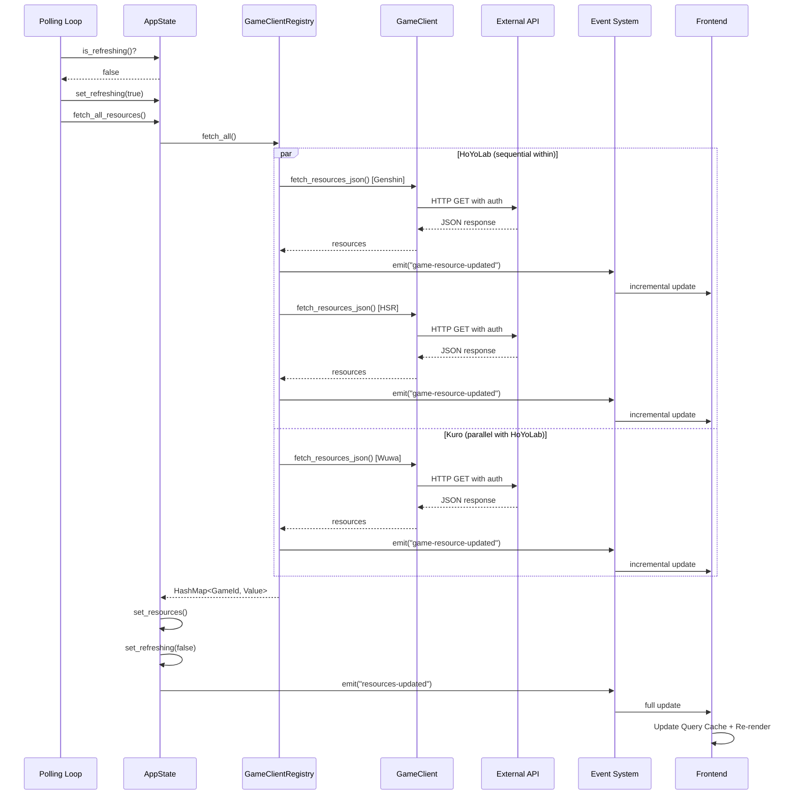
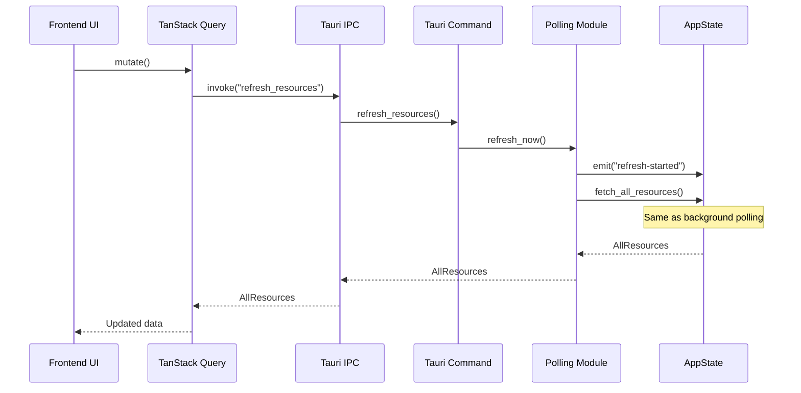
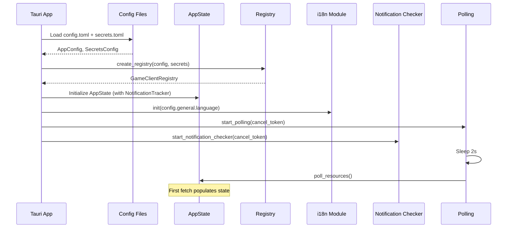
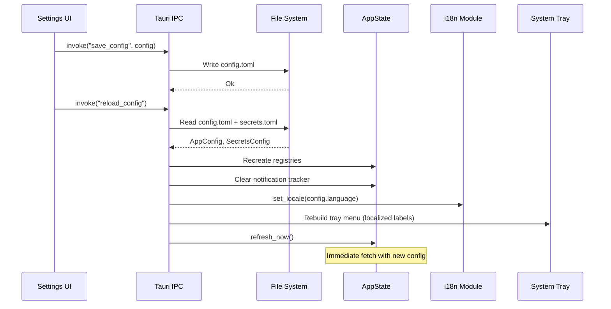
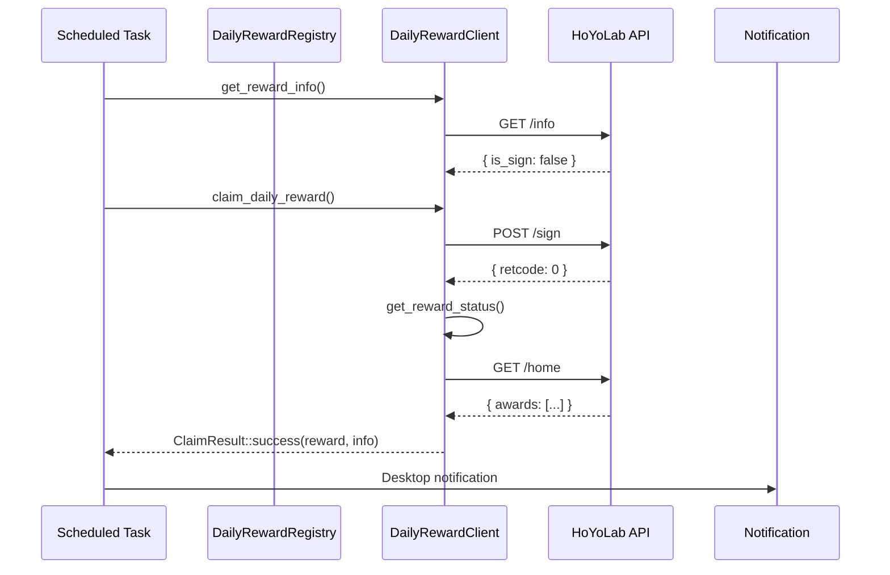
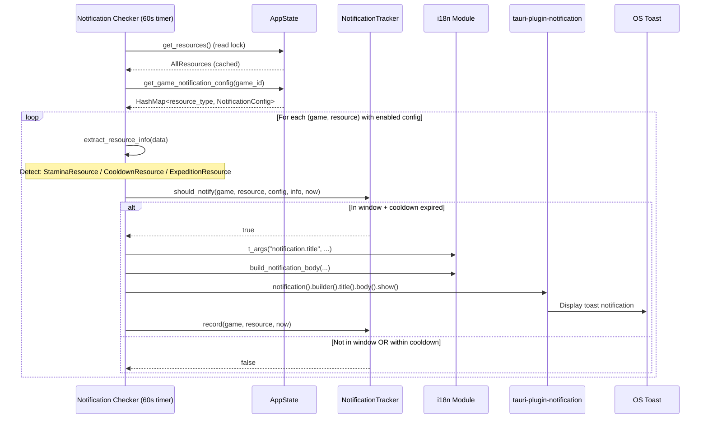
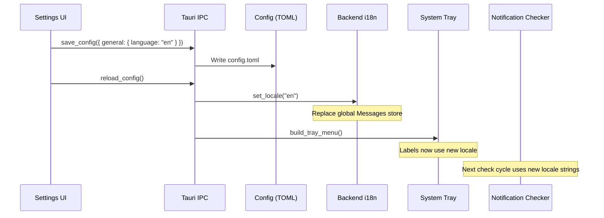

# Data Flow

Complete data flow through the system, from external game APIs to UI rendering.

## Overview

Primary data paths:

1. **Background Polling** — Periodic resource updates
2. **Manual Refresh** — User-triggered updates
3. **Initial Load** — App startup data fetch
4. **Config Updates** — Settings changes and reloading
5. **Daily Reward Claiming** — Automated and manual claiming
6. **Notification Checking** — Background resource alert evaluation
7. **Locale Switching** — Language change propagation

## 1. Background Polling Flow



### Key Steps

1. **Polling loop** wakes after `poll_interval_secs` (configurable, default 300s)
2. **Guard check**: Skip if already refreshing or no clients configured
3. **Registry groups** games by `ApiProvider`, fetches providers in parallel
4. **Within each provider**, games are fetched sequentially (rate limit safety)
5. **Per-game event** emitted immediately after each game completes
6. **Full update event** emitted after all games finish
7. **Frontend** receives events via Jotai effect atoms, updates TanStack Query cache

## 2. Manual Refresh Flow



Differences from background polling:
- **Returns data** synchronously to the caller
- **Emits `refresh-started`** so UI can show loading state immediately
- **Rejects** if already refreshing (returns error string)

## 3. Initial Load Flow



Timeline:
- **T+0ms**: Tauri app starts, config loaded, state initialized, i18n initialized
- **T+2000ms**: First resource fetch (background)
- **T+~3000ms**: Frontend receives first `resources-updated` event
- **T+60000ms**: First notification check runs (reads cached resources)

## 4. Config Update Flow



`reload_config()` recreates both `GameClientRegistry` and `DailyRewardRegistry` from the new config, clears notification cooldowns, updates the backend locale, rebuilds the tray menu, then triggers an immediate refresh.

## 5. Daily Reward Claiming Flow



Two phases:
1. **Startup claims**: Run once on app start, claim any unclaimed rewards
2. **Scheduled loop**: Calculate next claim time, sleep until then, claim with retry

Retry on transient errors with exponential backoff (3 retries, 500ms base, 30s max).

## 6. Notification Checking Flow



### Key Design Choices

- **No API calls**: Reads only cached state. Notification accuracy depends on polling freshness.
- **60-second check interval**: Balances responsiveness with CPU usage. Resource timers are minute-granularity anyway.
- **Separate from polling**: The notification checker runs on its own timer, independent of the polling loop. This means notifications keep checking even if a poll cycle takes longer than expected.
- **Write lock scope**: A single write lock is acquired for the entire check cycle to update the tracker. Read locks are released before the write lock is acquired.

## 7. Locale Switching Flow



**Frontend locale switching**: Paraglide JS handles frontend locale independently. The frontend reads `config.general.language` and sets the Paraglide runtime locale. Message functions automatically return strings in the active locale.

**What gets re-localized on language change**:
- System tray menu labels (rebuilt immediately)
- Future OS notification text (next check cycle)
- Frontend UI text (React re-render with new message functions)

## Data Transformations

### API Response → Frontend UI

```
1. External API JSON response
   { "current_resin": 150, "resin_recovery_time": "1708020000" }
       │
       ▼
2. Rust deserialization (game-specific response struct)
   DailyNoteResponse { current_resin: 150, resin_recovery_time: ... }
       │
       ▼
3. Transform to core resource type
   StaminaResource { current: 150, max: 160, full_at: DateTime, regen_rate_seconds: 480 }
       │
       ▼
4. Wrap in game-specific enum
   GenshinResource::Resin(StaminaResource { ... })
       │
       ▼
5. Serialize to JSON (type erasure at DynGameClient boundary)
   { "type": "resin", "data": { "current": 150, "max": 160, "fullAt": "...", "regenRateSeconds": 480 } }
       │
       ▼
6. Store in AllResources
   { "games": { "GENSHIN_IMPACT": [...], "HONKAI_STAR_RAIL": [...] }, "lastUpdated": "..." }
       │
       ├──▶ Tauri event → Frontend
       │
       └──▶ Notification checker reads cached data (no transformation)
            └── extract_resource_info() → ResourceInfo { completion_at, is_complete, current, max }
```

### Naming Convention at Boundaries

| Layer | Convention | Example |
|-------|-----------|---------|
| Rust structs | snake_case | `current_resin`, `full_at` |
| JSON serialization | camelCase | `fullAt`, `regenRateSeconds` |
| GameId enum | SCREAMING_SNAKE_CASE | `GENSHIN_IMPACT` |
| TypeScript interfaces | camelCase | `fullAt`, `regenRateSeconds` |
| Config/Secrets TOML | snake_case | `poll_interval_secs` |
| Backend i18n keys | dot.separated | `notification.resource_full` |
| Frontend i18n keys | snake_case | `settings_notifications_title` |

Serde's `#[serde(rename_all = "camelCase")]` handles the Rust↔JSON conversion automatically. See [frontend-tauri-bridge.md](../standards/frontend/frontend-tauri-bridge.md) for full details.

## Rate Limiting Strategy

```
┌─────────────────────────────────────────┐
│ HoYoLab provider (~1 req/sec limit)    │
│   Genshin ──→ HSR ──→ ZZZ             │
│         (sequential, no overlap)        │
└─────────────────────────────────────────┘
         ║ parallel (independent limits)
┌─────────────────────────────────────────┐
│ Kuro provider                           │
│   Wuwa ────────────────────────────────│
└─────────────────────────────────────────┘
```

Implementation: `join_all()` for parallel providers, sequential `for` loop within each provider. Daily reward claims add a 500ms delay between games.

## Error Handling

```
API Error
    ├── HTTP Error (network, timeout)
    │    └── reqwest-retry middleware retries with exponential backoff
    │
    ├── API Response Error (retcode != 0)
    │    └── ClientError::ApiError { code, message }
    │
    └── Game Client Error
         └── Type-erased Box<dyn Error>
              └── Logged via tracing::warn!, game skipped in results

Notification Error
    └── Failed to send OS notification
         └── Logged via tracing::warn!, cooldown NOT recorded (retries next cycle)
```

Failed game fetches don't crash the app or block other games. The UI shows stale data for the failed game until the next successful fetch.

## Timing Characteristics

| Event | Typical Latency |
|-------|----------------|
| Background poll | ~1-3s (depends on enabled games) |
| Manual refresh | ~1-3s (same, but blocks UI with loading) |
| Config reload | ~50-100ms (file I/O + registry recreation) |
| Daily reward claim | ~500ms-1s (single API call) |
| Notification check | <10ms (reads cached state only) |
| Event propagation (backend → frontend) | <10ms (in-process IPC) |
| UI update | <16ms (single React render frame) |
