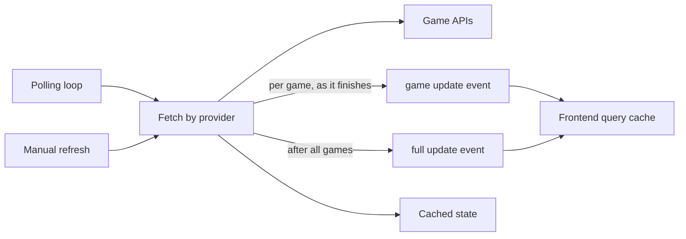
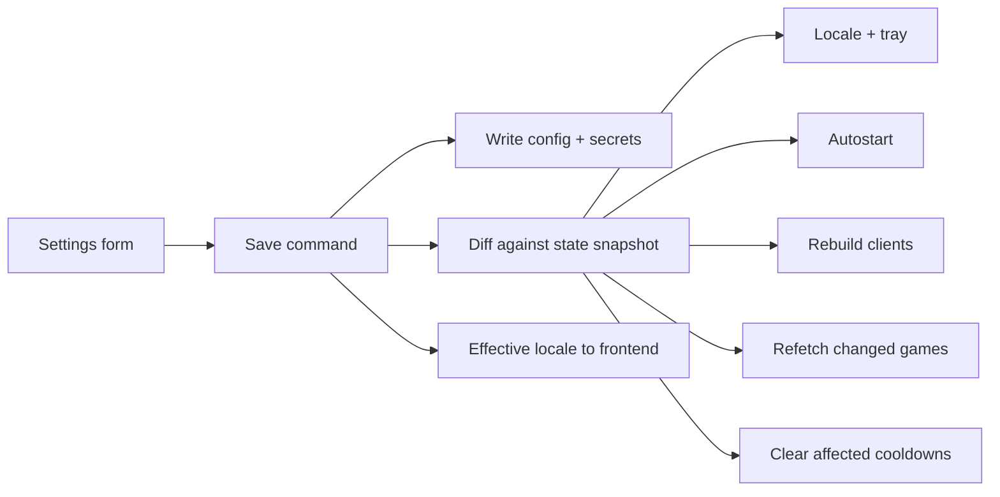

# Data Flow

How data moves between the game APIs, the backend, and the UI. Sequence detail lives in the code; this covers the paths and the guarantees each one makes.

## Paths

There are five: background polling, manual refresh, saving settings, daily reward claiming, and notification checking.

## Fetching Resources


```mermaid
graph LR
    Poll[Polling loop] --> Fetch
    Manual[Manual refresh] --> Fetch
    Fetch[Fetch by provider] --> API[Game APIs]
    Fetch -->|per game, as it finishes| PerGame[game update event]
    Fetch -->|after all games| All[full update event]
    PerGame & All --> Cache[Frontend query cache]
    Fetch --> State[Cached state]
```

Both entry points share the same fetch path, so they cannot race: whichever claims the refresh flag first runs, and the other is rejected or skipped. Within the fetch, providers run in parallel and games within a provider run in sequence.

Two kinds of update reach the frontend. Per-game events arrive as each game completes and let the dashboard fill in progressively; the full update arrives once the batch finishes. A manual refresh additionally returns its result to the caller, and announces itself with a start event so the UI can show a pending state immediately.

Failures are per game. A game that errors is logged and skipped, the rest of the batch continues, and the UI keeps showing that game's last known values until a later fetch succeeds.

## Startup

Config and secrets are loaded, the locale is resolved, autostart is synced with the config, registries are built, and the background tasks start. The first fetch runs after a short delay rather than at launch. The frontend registers its event listeners once at startup and asks the backend for the effective locale.

## Saving Settings


```mermaid
graph LR
    UI[Settings form] --> Save[Save command]
    Save --> Files[Write config + secrets]
    Save --> Diff[Diff against state snapshot]
    Diff --> Locale[Locale + tray]
    Diff --> Auto[Autostart]
    Diff --> Rebuild[Rebuild clients]
    Diff --> Refetch[Refetch changed games]
    Diff --> Cooldowns[Clear affected cooldowns]
    Save --> Result[Effective locale to frontend]
```

One command covers write, diff, and apply. Nothing is re-read from disk, and an empty diff applies nothing at all. Only the games whose client-relevant settings changed are rebuilt and refetched, which keeps threshold edits and other display-only changes free of API calls.

The command returns the locale that ended up in effect, and the frontend applies it. That round trip exists because a config value of "no language set" is resolved against the system locale on the backend, so the frontend cannot compute the answer itself.

## Daily Rewards

Claims happen at each game's configured time, plus a catch-up pass at startup for anything outstanding. Claiming retries transient failures with backoff and notifies on success. Manual claiming from the UI uses the same path.

The frontend tracks claim status separately from resources and watches for the UTC+8 date rollover, which is when the games reset. It re-checks shortly after the rollover rather than at the boundary, to let the game servers catch up.

## Notification Checking

Every minute, the checker reads cached resources and each game's notification settings, decides per resource whether it is inside its notification window, consults the cooldown state, and sends an OS toast if both agree. No network calls are involved. See [03-core-components.md](03-core-components.md) for the threshold and cooldown semantics.

## Boundaries and Conventions

Data crosses three boundaries with different naming conventions on each side:

| Layer | Convention | Example |
|-------|-----------|---------|
| Rust structs | snake_case | `full_at` |
| Resource JSON and TypeScript | camelCase | `fullAt` |
| Game identifiers | SCREAMING_SNAKE_CASE | `GENSHIN_IMPACT` |
| Config and secrets, both sides | snake_case | `poll_interval_secs` |
| i18n keys | flat snake_case | `settings_notifications_title` |

Resource types are renamed to camelCase at serialization. Config and secrets are the deliberate exception: they stay snake_case end to end so the Rust types serialize straight into the TOML files with no DTO layer, and the TypeScript mirror matches key for key.

There is no code generation between the two languages. Config and resource types are mirrored by hand, so adding a field means editing both sides. In exchange there is no build step and no generated code in review. Where a mismatch would be silent rather than a type error, a test guards it instead.

## Rate Limiting

```
HoYoLab provider (shared limit)
    Genshin -> HSR -> ZZZ        sequential
        ||  parallel
Kuro provider (independent limit)
    Wuthering Waves
```

This is the constraint behind the fetch strategy and behind daily claims being spaced out rather than fired at once. Any new game inherits it by being grouped under its provider.
